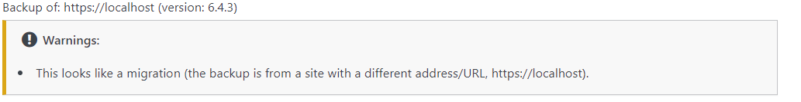
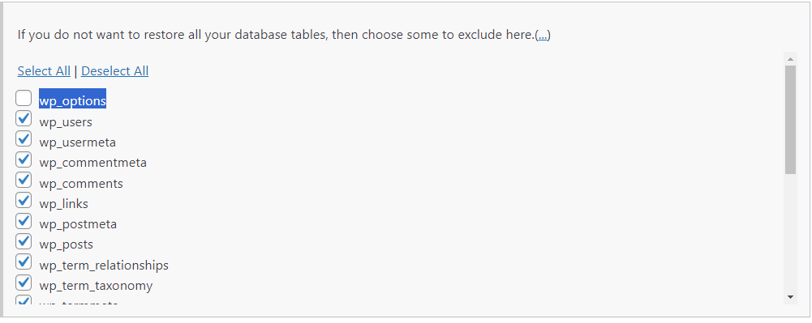
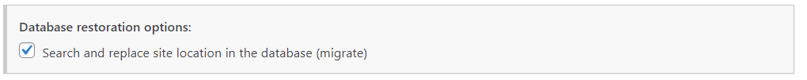

# docker-wordpress

This repo handles creating a local running docker instance that can be used as a staging environment for changes to PRODUCTION.

## Prepare for creating a staging site

- In your production environment install the UpDraft plugin and create a backup of everything
- Download all the backup files to your local machine
- From a PowerShell command prompt from this projects root directory execute ```.\setup.ps1  localhost```
- This will setup the initial wordpress site on localhost. This is needed so you can get WordPress installed initially
- Once running in Docker, go to Plugins and install the UpDraft plugin again in the fresh install
- Upload the backup files you downloaded earlier
- Start the restore process

## Importing Prod to local

- When restoring on the importing the database step you may be prompted about UTF8 not supported in the database.
  - Select **utf8mb4** from the list and click restore
- Once the database is restored as the plugins are installing you will be prompted to login again. This is your PRODUCTION login
- Once the restore is complete navigate to ```https://localhost/wp-admin/``` again to login. This is your PRODUCTION login
- Your site is now setup and running with HTTPS


## Moving your local staging site to Prod

- Create a final backup with UpDraft in PRODUCTION
- Create a backup with Updraft from local docker WordPress
- Download the local docker WordPress Updraft backup
- Go to the PRODUCTION website and upload the backups from your local WordPress
- You are going to see a warning ```This looks like a migration (the backup is from a site with a different address/URL, https://localhost).```
  
- Under this section ```If you do not want to restore all your database tables, then choose some to exclude here``` expand the selection and choose all table EXCEPT **wp_options**
  
- Ensure this IS selected ```Search and replace site location in the database (migrate)```
- 
- You may get prompted to login again. Use your PRODUCTION login
- Once restore is complete, you will need to go to the Appearance >  Themes menu item and activate the new theme.
  - This is needed because we did not import the options table
- Verify your site looks as expected
- Create a new UpDraft backup of the new site
